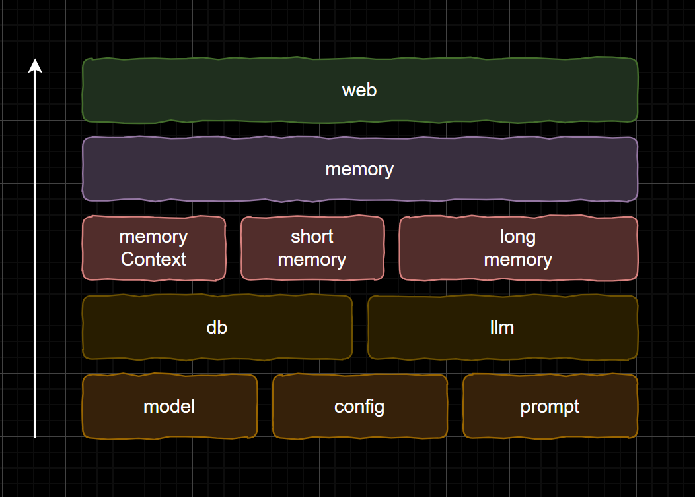
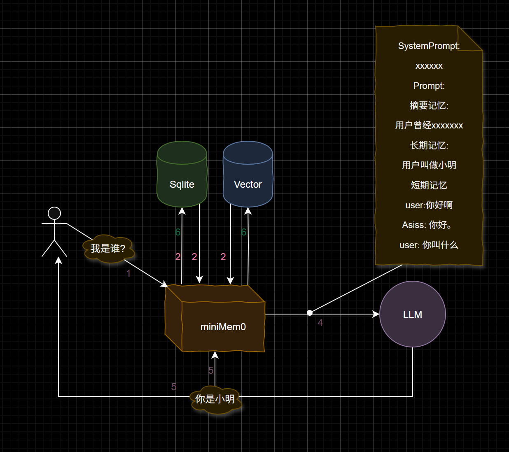

# MiniMem0
>MiniMem0 是一个轻量级、无需外部依赖的大模型记忆系统，专为大型语言模型(LLM)开发者设计。它提供了简洁的API接口和HTTP服务，帮助您的LLM应用实现解耦的记忆功能。
- 直观可视：提供可视化操作界面，实现记忆系统的便捷管理；
- 轻量高效：专为单机与低资源环境优化，大幅降低部署与运行成本；
- 快速集成：极简依赖设计，支持一键部署或嵌入式接入，助力AI应用快速获得记忆能力。


# 项目结构

# 特性
🚀 零依赖：纯Go实现，内嵌chromem-go，不依赖任何外部数据库或组件

📦 即插即用：支持直接导入使用或通过HTTP服务调用

🌐 HTTP接口：提供RESTful API实现系统解耦

💾 持久化记忆：支持将记忆数据保存到本地文件

🔍 记忆检索：提供多种记忆查询方式

⚡ 高性能：优化设计，适合与大模型配合使用

# 基本原理
>MiniMem0 采用长期记忆 + 短期记忆 + 摘要记忆的模式
在请求大模型阶段前，传入问题，MiniMem0将整理问题并返回带有记忆的上下文内容
在大模型相应后, 将模型响应内容 传入MiniMem0，MiniMem0将整理响应并且自动持久化

参考论文链接：
https://arxiv.org/html/2504.19413v1

# 使用方式



## 安装
------------
使用go get命令安装miniMem0包：

```base
go get github.com/xuanlv2002/miniMem0
```

## 快速开始

0. 完善config文件

在beta版本 所有的配置文件都是必须得,你可以参考default.yaml来完成配置,作者使用硅基流动来接入大模型，你可以使用所以适配OpenAI格式的接口。
```
LLM: 
  MODEL: "Qwen/Qwen2.5-Coder-32B-Instruct"
  BASE_URL:  "https://api.siliconflow.cn/v1"
  API_KEY: "sk-xxxxxxxxxxxxxxxxxxxxxxx"
  TEMPERATURE: 0

EMBEDDING:
  MODEL: "Qwen/Qwen3-Embedding-4B"
  BASE_URL:  "https://api.siliconflow.cn/v1"
  API_KEY: "sk-xxxxxxxxxxxxxxxxxxxxxxxxxxx"
  DIMENSIONS: 2048

VECTOR_DB:
  PATH: "memory_db/long_term_memory"
  COLLECTION_NAME: "long_term_memory"
  TOPK: 10  # 最大返回数量
  SIMILARITY_THRESHOLD: 0.4 # 相似度最小阈值

SQL_DB:
  PATH: "memory_db/context_memory.db"


CONTEXT_MEMORY:
  SUMMARY_GAP: 6 # 每隔n条记录 更新一次摘要。 这个值最好 <= SHORT_WINDOW 确保summary 和 短期记忆有重叠 避免信息丢失

SHORT_MEMORY:
  SHORT_WINDOW: 6 # 短期记忆长度 最近的n条记录作为短期记忆
 
LONG_MEMORY:
  LONG_GAP: 4 # 长期记忆间隔  每n条记录更新一次长期记忆(通过摘要和n条短期记忆进行总结) LONG_GAP < SHORT_WINDOW 确保长短期记忆间有一定重叠 避免信息丢失
```

1. 导入包

在你的Go代码中导入miniMem0及相关依赖：

```
import (
	"bufio"
	"context"
	"fmt"
	"os"

	"github.com/sashabaranov/go-openai"
	"github.com/xuanlv2002/miniMem0/config"
	"github.com/xuanlv2002/miniMem0/memory"
)
```

2. 基础使用示例
```
func main() {
	// 加载配置文件
	conf, err := config.LoadConfig("config/local.yaml")
	if err != nil {
		panic(fmt.Sprintf("加载配置失败: %v", err))
	}

	// 初始化记忆系统
	memSys, err := memory.NewMemorySystem(conf)
	if err != nil {
		panic(fmt.Sprintf("初始化记忆系统失败: %v", err))
	}

	// 初始化LLM客户端
	llmModel := llm.NewLLM(conf.GetChatConfig())

	// 创建交互式命令行界面
	reader := bufio.NewReader(os.Stdin)
	fmt.Println("个性化AI助手已启动(输入'q'退出):")

	for {
		fmt.Print("用户输入: ")
		input, _ := reader.ReadString('\n')
		
		// 退出条件
		if strings.TrimSpace(input) == "q" {
			fmt.Println("感谢使用，再见！")
			return
		}


		// 通过记忆系统处理输入
		enhancedPrompt, err := memSys.ProcessInput(input)
		if err != nil {
			fmt.Printf("输入处理错误: %v\n", err)
			continue
		}
		fmt.Printf("增强后的提示: %s\n", enhancedPrompt)

		// 获取LLM响应
		response, err := llmModel.Chat(context.Background(), []openai.ChatCompletionMessage{
			{
				Role:    openai.ChatMessageRoleSystem,
				Content: "你是一个个性化AI助手，能够根据记忆提供定制化回答",
			}, {
				Role:    openai.ChatMessageRoleUser,
				Content: enhancedPrompt,
			},
		})
		if err != nil {
			fmt.Printf("获取AI响应失败: %v\n", err)
			continue
		}

		fmt.Printf("AI回复: %s\n", response.Content)
		
		// 将输出存入记忆系统
		memSys.ProcessOutput(response.Content)
	}
}
```

miniMem0系统会根据你对模型的输入和模型的输出,自动处理上下文记忆、短期记忆、长期记忆。

# 下一步
本系统当前未完全完成,下面是未来的开发计划:
- 添加记忆管理页面 undo
- 支持更多的上下文工程内容 undo
- 支持单独部署服务 undo
- 支持多用户、多会话 undo
